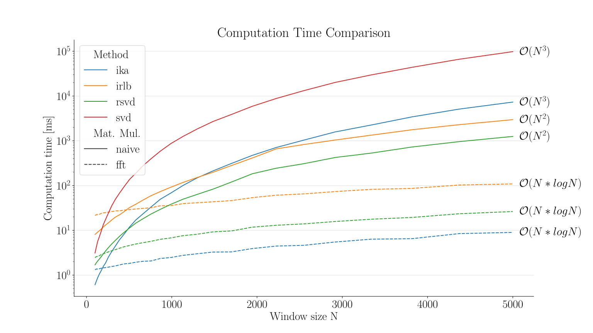

# Accelerating Singular Spectrum Transformation for Scalable Change Point Detection.

This repository contains the code for the paper 

**Accelerating Singular Spectrum Transformation for Scalable Change Point Detection**.


The repository aims to make the research and results from the paper reproducible. While we are not aware of any 
imminent restrictions, we recommend setting up Pythen 3.9 or newer (we used Python 3.11). While the paper uses square
Hankel matrices for clarity, the algorithms work for rectangular matrices as well, and the code in this repository
supports them as well. Additionally, we support  lagged columns (where the sliding window for the Hankel matrix makes steps larger than one).

The code is mainly focused on the paper, for code with a better interface see the following:

> If you only want to use the algorithms, check out package [changepoynt](https://github.com/Lucew/changepoynt)
> where we will make the methods pip-installable and accessible.

## Minimal Example
We provide a minimal example in the file [MinimalExample.py](MinimalExample.py) and a Jupyther Notebook [MinimalExample.ipynb](MinimalExample.ipynb).
The code exemplary shows the speed-up and scoring error.

> The Jupyther Notebook [MinimalExample.ipynb](MinimalExample.ipynb) also contains plots of the different scores

To run it you only have to install `changepoynt` and `tqdm`_
Normally, you can just use `pip install changepoynt` but for reproducibility, we install a certain
commit from the package's [GitHub repository](https://github.com/Lucew/changepoynt).
```bash
pip install git+https://github.com/Lucew/changepoynt.git@b4ea5ca606138578e2aa785dc921a5fe7af8c07d tqdm
```

and then run the file with
```bash
python MinimalExample.py
```

We also provide a Jupyther Notebook: [MinimalExample.ipynb](MinimalExample.ipynb).
You can host this on any Notebook server (e.g., [Google Colab](https://colab.research.google.com/)) so you can run
the minimal example without installing anything locally.

## Fast Hankel Matrix Product
If you only want to use the fast Hankel matrix product, take a look at the functions `fast_numba_hankel_left_matmul`, 
`fast_numba_hankel_matmul`, and `get_fast_hankel_representation` in [fastHankel.py](utils/fastHankel.py). For the
decompositions using these functions look at `randomized_hankel_svd_fft` and `irlb_fft` in 
[changepointComparison](changepointComparison.py). 

⚠ Do not forget to set your thread limit for the Numba package with `numba.set_num_threads()` according to your setup
or deactivate parallelization `parallel=False` in the decorators,  if you encounter performance issues or very high 
CPU utilization! Numba will try to spawn as many threads as logical CPUs, which sometimes leads to lower performances.


Our package [changepoynt](https://github.com/Lucew/changepoynt) includes matrix classes that are numpy compatible and
implement all the necessary functions.

> Consider using `scipy.sparse.linalg.LinearOperator` using our `fast_numba_hankel_left_matmul` and 
> `fast_numba_hankel_matmul` if you want to speed up your algorithms working on Hankel matrices

## Intermediate Results (Recreating Plots)
Rerunning all experiments took us around ten days on a capable 64 physical core compute server. See the sections
below for information how to rerun all our experiments. We saved intermediate results to reduce the reproducibility effort.

To enable recreating the plots, we use [git lfs](https://docs.github.com/en/repositories/working-with-files/managing-large-files/installing-git-large-file-storage)
to host intermediate results in the repository.

The files are:
- Decompositions error and  Singular Value Spectrum: [Decomposition.parquet](evaluation/Decomposition.parquet) and [Decomposition_simulated.parquet](evaluation/Decomposition_simulated.parquet)
- Scoring error and Timing Measurements: [Changepoint_WindowSizes.parquet](evaluation/Changepoint_WindowSizes.parquet) and [Changepoint_simulated_WindowSizes.parquet](evaluation/Changepoint_simulated_WindowSizes.parquet)

To recreate the plots from these intermediate results, download and place all files in the [evaluation folder](/evaluation).
You have to either install [git lfs](https://docs.github.com/en/repositories/working-with-files/managing-large-files/installing-git-large-file-storage)
before cloning or download and place the files manually using the web interface.

Navigate into the evaluation folder:
```bash
cd ./evaluations
```

For Figs. 3a, 4a, 4b run:
`python evaluateDecomposition.py`

For Figs. 5a and 7 run:
`python evaluateChangepointComparison.py`

For Fig. 6 run (can take around 30s):
`python evaluateScoreScatter.py`

## Data Preparation
We are very thankful to Eamonn Keogh and all the contributors to the 
[UCR Time Series Archive](https://www.cs.ucr.edu/%7Eeamonn/time_series_data_2018/). In addition to the simulated data,
we use this archive for our empirical measurements. The directory [preprocessing](preprocessing/) contains all the
necessary to preprocess the repository. Adapt the path in the main function of 
[processUcrArchive.py](preprocessing/processUcrArchive.py) to the path where the extracted archive is located. The 
archive is public and downloadable. The resulting hdf5-file will have about 650 MB.

## Decomposition Results
The paper evaluates the proposed method in two steps. First checking the decomposition and then computing the change
score in comparison to a baseline. To run the decomposition evaluation use
[decompositionComparison.py](decompositionComparison.py) with the flag `-sim True` for the real signals and `-sim False`
for the simulated signals. To keep as true to the measurements in the paper, we recommend using a conda environment
that also makes sure the optimal array processing libraries are installed. The script will use all cores available, so 
take care when running on a shared machine.

## Score Results
The second step of the paper is measuring the scoring error and computation times. To see similar performance increases
with parallelization as in the paper, your processor should have more than ten cores. The script might run for multiple 
days. Run [changepointComparison.py](changepointComparison.py) with the flag `-sim True` for the real signals and 
`-sim False` for the simulated signals.

## Creating the Plots
Once both results are available, the directory [evaluation](evaluation/) contains all the necessary code to plot the 
results similar to the paper. There are more plots available than we could fit into the paper. The main plots also 
contained in the paper are a result of [evaluateDecomposition.py](evaluation/evaluateDecomposition.py) for the overall 
performance of the decomposition and [evaluateChangepointComparison.py](evaluation/evaluateChangepointComparison.py) 
for the score error and the computation times. [evaluateScoreScatter.py](evaluation/evaluateScoreScatter.py) creates the
scatter plot comparing the ground truth scores with the approximated scores.

Change the global variables at the beginning of the plot scripts 
`SAVE_CONFIG = False` to see the plots immediately, otherwise, they will be saved as .pgf files. `SIMULATION = False` 
and `SIMULATION = True` toggles between signals from the UCR archive and simulated signals.

## Acknowledgement
Projects like this are never solely the outcome of one research paper.
Therefore, we want to thank all the countless contributors and initiators of Python and key libraries like numpy, 
scipy, matplotlib, tqdm, seaborn, numba and pandas.

Other than that, this repository contains modified code from [irlbpy](https://github.com/bwlewis/irlbpy) licensed under
the APL2.0 at the time of publishing this code.
We also took inspiration from the implementation of [SST](https://github.com/statefb/singular-spectrum-transformation)
licensed under the MIT license at the time of publishing this code.
We also modified code from [fbpca](https://github.com/facebookarchive/fbpca) licensed using the BSD licensed at the time
of publishing this code. Additionally, we want to express our gratitude to the developers of
[rocket-fft](https://github.com/styfenschaer/rocket-fft) lincensed with a BSD3 license, which enabled us to use numba
with the FFT and signicantly increase the speed of the algorithms.
[Threadpoolctl](https://github.com/joblib/threadpoolctl) with a BSD3 license was used to make measurements with
thread limitations.
